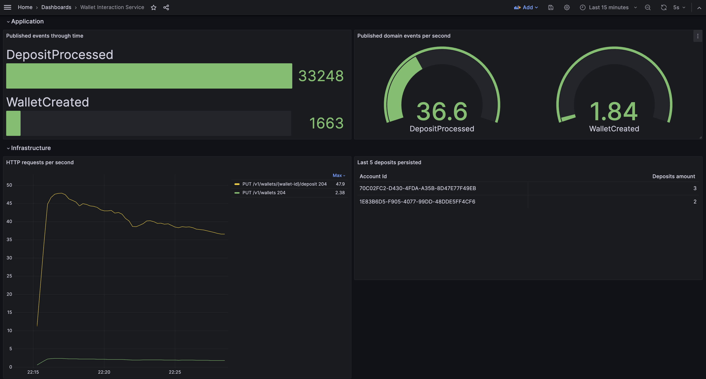

# 🧙‍♂️🔎 [Observable] Wallet Interaction Service 💰💸


[](/pom.xml)
[](/pom.xml)
[](/pom.xml)

🎮 Play with the API using [SpringDoc OpenAPI Swagger UI](http://localhost:8080/swagger-ui/index.html) and review metrics
from the
[Grafana dashboard](http://localhost:3000/d/da840768-d79b-46c5-8c09-95bb9e2a148b/wallet-interaction-service?orgId=1&refresh=5s):



🧪 Run tests
<br>

```shell script
./mvnw clean verify
```

🚀 Run services
<br>

```shell script
./mvnw clean package
docker compose up -d
```

🌃 Stop services
<br>

```shell script
docker compose down --rmi local
```

📣 This project has been structured following Hexagonal Architecture principles:
https://alistair.cockburn.us/hexagonal-architecture
